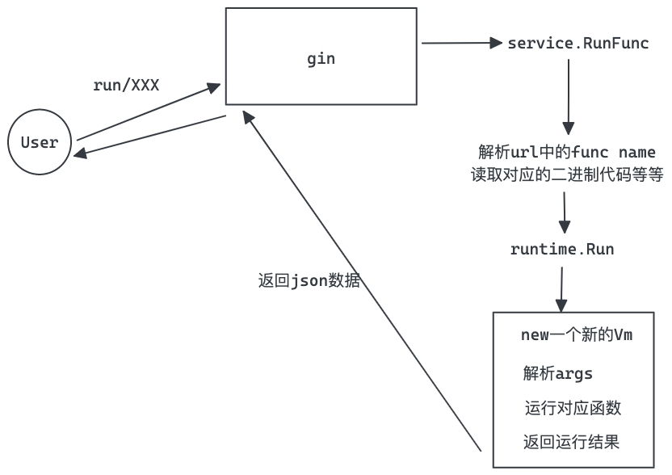

#基于WasmEdge的一个简单severless runtime

## 准备阶段

首先需要install一下llvm

```
brew install llvm
```

然后按照[官方文档](https://wasmedge.org/book/en/embed/go/ref.html)安装相关的库

```
curl -sSf https://raw.githubusercontent.com/WasmEdge/WasmEdge/master/utils/install.sh | bash -s -- -v 0.9.1
```

接下来建立一个新的go 项目，并且下载go sdk

```
go get github.com/second-state/WasmEdge-go/wasmedge@v0.9.2
go get github.com/second-state/wasmedge-bindgen@v0.1.12
```

安装tinygo

```
brew tap tinygo-org/tools
brew install tinygo
```

## 程序需求

这边希望实现一个demo级别的serverless的function runtime。

用户通过一个接口`/run/_FUNC_HASH_?func=_FUNC_NAME_&arg=_ARG_`

去访问wasm文件里面对应的函数。

## 程序规划

程序目录规划如下

```
.
├── code_loader  代码加载器，加载代码文件，可以从oss或者filesystem中加载
├── config.yaml  项目配置文件
├── go.mod
├── go.sum
├── lib          项目lib、util这些东西
├── main.go			 代码入口
├── runtime      存放调用wasmEdge vm相关代码，是本程序的核心
├── serverless_demo   用于写一些wasm测试代码，编译为wasm
├── serverless_funcs  存放编译好的wasm代码
└── service      业务代码，接收路由数据

```

技术栈选型

http server包，选用`Gin`

config解析包，选用`viper`

类型转换包，选用`cast`

wasm运行包，当然是选用`wasmedge`

程序执行流程如下



## 代码设计

详细看代码

## 结果验证

需要写一些代码

```go
package main

import (
	"fmt"
)

func main() {
	s := 0
	for i := 0; i < 100; i++ {
		s += i
	}
	fmt.Println(s)
}

//export sum
func sum(a int, b int) int {
	return a + b
}

//export fibArray
func fibArray(n int32) int32 {
	arr := make([]int32, n)
	for i := int32(0); i < n; i++ {
		switch {
		case i < 2:
			arr[i] = i
		default:
			arr[i] = arr[i-1] + arr[i-2]
		}
	}
	return arr[n-1]
}

//export fib
func fib(n int32) int32 {
	switch {
	case n < 2:
		return n
	default:
		return fib(n-1) + fib(n-2)
	}
}

```

这边暴露了3个函数，以及一个主函数。

由于go默认编译出来webassembly是不支持WASI的，所以需要用tinygo去编译。

```
cd serverless_demo
tinygo build -o  ../serverless_funcs/myfirst_serverless_func -target wasi main.go
```

这边来一一测试下

#### main函数

因为这边的入口函数，tinygo编译以后输出的是`_start`

所以需要用_start来代替main

不然直接访问`http://127.0.0.1:8080/run/myfirst_serverless_func?func=main`会提示如下错误

```json
{
  "code": -1,
  "msg": "function main not found"
}
```

修改后得到这个url`http://127.0.0.1:8080/run/myfirst_serverless_func?func=_start`

得到的结果如下

```json
{
  "code": 0,
  "data": [
    
  ]
}
```

会发现没有返回值，这是因为main函数没有返回值。但是由于fmt.println了，所以能在控制台找到4950这个输出。

#### fib函数

访问接口：`http://127.0.0.1:8080/run/myfirst_serverless_func?func=fib&arg=1`

调用fib函数，传入参数1

获得输出结果

```json
{
  "code": 0,
  "data": [1]
}
```

把arg改为10，访问

`http://127.0.0.1:8080/run/myfirst_serverless_func?func=fib&arg=10`

输出

```json
{
  "code": 0,
  "data": [
    55
  ]
}
```

#### sum函数

sum函数在写的时候，是需要输入2个数字，然后把他们加其他返回结果。

构造如下url:`http://127.0.0.1:8080/run/myfirst_serverless_func?func=sum&arg=100,89`

可以看出来调用sum函数，传入参数100,89。参数中间用逗号分割

得到结果

```json
{
  "code": 0,
  "data": [
    189
  ]
}
```

#### fibArray函数

这个是另外一个费拨那契数列的实现

直接构造地址访问`http://127.0.0.1:8080/run/myfirst_serverless_func?func=fibArray&arg=100`

得到如下结果

```json
{
  "code": 0,
  "data": [
    -889489150
  ]
}
```

很明显，数据太大，直接溢出了，哈哈哈


## 不足

这边现在最大的不足是，还不支持字符串和复杂数据结果的传入和传出。看了下文档貌似还很复杂，得通过内存暂存去传输。


